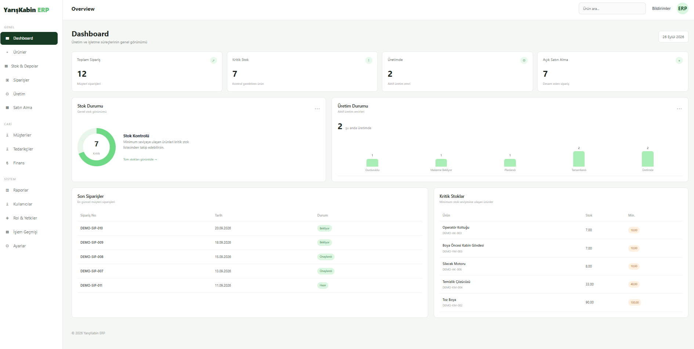

# YarisKabin ERP

YarisKabin ERP is a manufacturing-oriented Enterprise Resource Planning (ERP) web application developed with ASP.NET MVC, C#, .NET Framework, Entity Framework, and SQL Server.

The project was designed to manage and monitor core manufacturing processes through a centralized web-based system. It includes modules for inventory and warehouse management, customer orders, production, purchasing, customers and suppliers, financial tracking, reporting, notifications, users, roles, and permissions.

The application was developed as part of my software development internship and serves as a practical project for applying database design, backend development, MVC architecture, and web interface development.

## Key Features

- Inventory and warehouse management with physical, reserved, and available stock tracking
- Critical stock monitoring based on minimum stock levels
- Customer and order management
- Production order and operation tracking
- Purchasing and supplier management
- Goods receipt and partial delivery tracking
- Customer receivables, supplier payables, payments, and general expense tracking
- Manufacturing cost monitoring
- Dashboard with key operational indicators
- Reporting for production, purchasing, inventory, warehouses, and finance
- User, role, and permission management structure
- Notification and activity log modules

- ## Technologies

- C#
- ASP.NET MVC 5
- .NET Framework 4.8
- Entity Framework 6
- SQL Server
- LINQ
- Razor Views
- HTML5
- CSS3
- JavaScript
- Bootstrap
- Git & GitHub

-## Project Modules

- Product Management
- Inventory and Warehouse Management
- Customer Order Management
- Production Management
- Purchasing and Supplier Management
- Goods Receipt Management
- Customer Management
- Supplier Management
- Financial Management
- Reporting and Dashboard
- User Management
- Role and Permission Management
- Notification Management
- Activity Log Management
- System Settings

- ## Architecture

The project follows the ASP.NET MVC architecture and separates the application into Models, Views, and Controllers.

- Model: Represents database entities and application data
- View: Provides the user interface using Razor views
- Controller: Handles user requests, application flow, and data operations
- Entity Framework: Provides communication between the application and SQL Server
- ViewModels: Transfer only the required data from controllers to views

- ## Database

The application uses Microsoft SQL Server as its relational database management system and Entity Framework 6 for data access.

The database is designed with relational tables, primary keys, foreign keys, unique constraints, and validation constraints to maintain data integrity.

The system contains 47 interconnected tables covering the main ERP processes, including:

- Products and product variants
- Warehouses, inventory, and stock movements
- Customers and customer orders
- Bills of materials (BOM)
- Production orders and operations
- Suppliers and purchasing
- Goods receipts
- Customer receivables and collections
- Supplier payables and payments
- General expenses and production costs
- Shipments
- Users, roles, and permissions
- Notifications
- System settings
- Activity logs

## Inventory Logic

The inventory module tracks stock at warehouse and product level.

Available Stock = Physical Stock - Reserved Stock

Products can be monitored according to minimum stock levels, allowing critical stock situations to be identified.

Stock movements are recorded separately from current stock balances so that inventory changes can be tracked historically.

## Production Management

The production module manages production orders and their related operations.

Production orders can be associated with products, planned quantities, production areas, and operational steps. Production progress can be monitored through different production statuses.

The system also supports bill of materials (BOM) structures for defining the materials required for manufacturing.

## Purchasing Process

The purchasing module manages supplier purchase orders and their details.

The system supports:

- Supplier-based purchase orders
- Ordered and received quantity tracking
- Partial deliveries
- Goods receipt records
- Accepted and rejected quantities
- Warehouse-based receipt tracking

## Financial Management

The financial module provides records for:

- Customer receivables
- Customer collections
- Supplier payables
- Supplier payments
- General expenses
- Production costs

Financial information is presented through summary indicators and reporting screens.

## Reporting

The reporting module provides operational summaries for:

- Orders
- Production
- Purchasing
- Critical stock
- Financial data
- Warehouse stock distribution

The dashboard also presents key operational indicators for quick monitoring of the ERP system.

## Project Status

This project was developed as a practical manufacturing ERP application during my software development internship.

The current version demonstrates the database architecture, ERP modules, data relationships, reporting structure, and web-based management interface.

Role and permission structures are included in the database design. Full authentication and authorization enforcement is not implemented in the current version.

## Future Improvements

Possible future improvements include:

- Authentication and authorization
- Automatic notification generation
- Automatic activity logging
- Advanced production planning
- Dynamic material requirement planning
- Extended financial analysis

## Application Screenshot

### Dashboard

